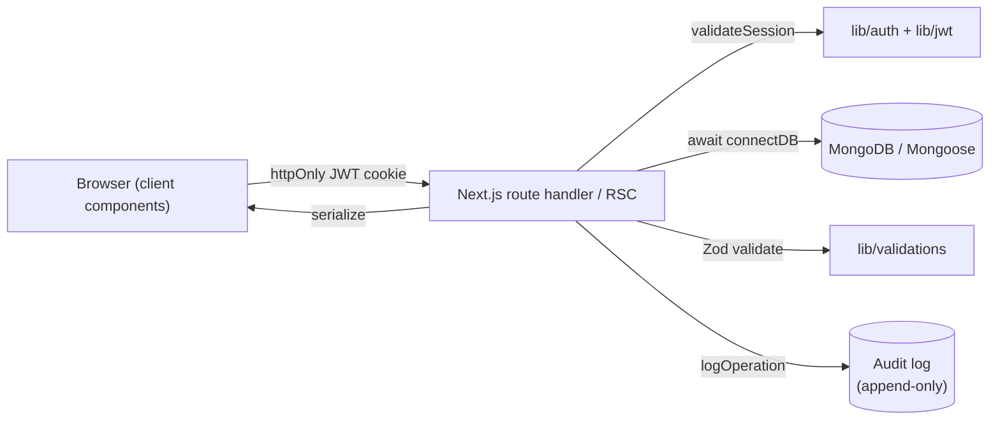

# Pragati

If everyone could see the whole board, most status meetings wouldn't need to
exist. So here, everyone sees the whole board.

[](https://github.com/abhipatelz/Pragati/actions/workflows/ci.yml)
[](#stack)
[](./docs/ARCHITECTURE.md)
[](./LICENSE)

**Run your own in ~10 minutes** — free tiers end to end, first account created
in the browser:

[](https://vercel.com/new/clone?repository-url=https%3A%2F%2Fgithub.com%2Fabhipatelz%2FPragati&env=MONGODB_URI,JWT_SECRET&envDescription=MONGODB_URI%3A%20free%20MongoDB%20Atlas%20connection%20string%20%C2%B7%20JWT_SECRET%3A%20a%20long%20random%20secret&envLink=https%3A%2F%2Fgithub.com%2Fabhipatelz%2FPragati%2Fblob%2Fmain%2Fdocs%2FSELF_HOSTING.md&project-name=pragati)

The full path — including using it **solo**, e.g. tracking an exam with a hard
date: [`docs/SELF_HOSTING.md`](./docs/SELF_HOSTING.md).

**[Live app](https://pragatialm.vercel.app)** — look around with a demo
account, nothing to set up:

| Email | Password | Role |
| --- | --- | --- |
| `demo.lead@pragati.local` | `Demo@1234` | Team Lead (best first look) |
| `demo.ic@pragati.local` | `Demo@1234` | Individual Contributor |

These are public demo accounts on a public demo workspace — don't put anything
real in them. Details: [`docs/DEMO_ENVIRONMENT.md`](./docs/DEMO_ENVIRONMENT.md).

## 60 seconds, in motion


<table>
<tr>
<td width="50%"><br/><sub>Dashboard — up next, team projects, momentum</sub></td>
<td width="50%"><br/><sub>Cmd/Ctrl+K command palette — navigate, search, quick-add a task</sub></td>
</tr>
<tr>
<td width="50%"><br/><sub>Project detail — lifecycle phases or Kanban, your choice</sub></td>
<td width="50%"><br/><sub>Bird's-eye view — the whole project as one living tree</sub></td>
</tr>
</table>

## What it is

Project and task management for teams, built on one question: *why does a
contributor only get to see their own slice?* There's no good reason — so here
they don't. Everyone gets a view of everything moving in their team, plus a
truly private personal space nobody else can see, admins included. Born in
pharma quality work, so every change is recorded and nothing is quietly
deleted; the model itself works anywhere. Invite-only — there is no public
sign-up.

| Role | What they see |
| --- | --- |
| **Contributor** | Their tasks, their day, and private personal projects invisible to everyone else. |
| **Team Lead** | Their teams, projects and tasks; assigns work; tracks progress. |
| **Admin** | The whole workspace, user management, the audit log. |

## How the product thinks

These aren't features so much as defaults:

- **The most important task comes first.** The dashboard opens on the single
  highest-leverage task on your plate — with the reasons shown, so you can
  disagree with it.
- **Think at a whiteboard, not in a deck.** A full-page drawing surface, in
  the main nav for every role, private to its owner — which is exactly what
  makes people willing to think honestly on it.
- **Top 5 Things.** Everyone writes five lines a week — what they're working
  on, watching, worried about. The feed is open to the whole team, with no
  layer between an observation and whoever needs to hear it. Deliberately
  un-audited: thoughts stop being honest the moment they become paperwork.
- **The forecast shows its slack.** Alongside the statistical finish dates,
  every project gets a *speed-of-light* date — the fastest it could possibly
  finish if nothing ever waited in a queue. The gap between that and the
  forecast is exactly the delay a lead can act on.
- **Evenings belong to your people.** After hours, the app stops cheering you
  toward the backlog and starts pointing you home. The work will keep.

## Engineering at a glance

Solo-built, in production. These numbers come from the repo itself — `npm
test`, `find`, `git log` — not from a pitch:

| | |
| --- | --- |
| **~62,000** lines of TypeScript | **93** API route handlers |
| **19** Mongoose models | **294** unit tests + **5** end-to-end specs, all green |
| **675+** commits of real iteration | Typecheck · lint · test · build gated on every push |

Decisions worth a closer look — each one started by questioning a default:

- **No AI on any decision path.** The obvious move is "add AI." Rejected: the
  triage, slip-risk, and forecasting engines (`src/lib/ai/*`) are plain,
  deterministic, unit-tested code. You can't debug a model weight; you can
  debug a line.
- **One permissions table drives both the UI and the API.**
  [`src/lib/permissions.ts`](./src/lib/permissions.ts) is the single source of
  truth, imported by both sides — so what a role sees and what it can do can
  never disagree.
- **A natural-language quick-add with zero dependencies.** Type "Ship the QA
  report urgent tomorrow" and a small, fully tested parser
  ([`src/lib/quickAddParse.ts`](./src/lib/quickAddParse.ts)) extracts the
  date, the priority, and a clean title. No library needed.
- **Early warning, learned per person.** Open work likely to miss its date
  gets flagged before it does — from each person's own delivery history, every
  score traceable to a line of code
  ([`src/lib/ai/slipRisk.ts`](./src/lib/ai/slipRisk.ts)).



Reads go straight from server components to the data layer; every change flows
through a validated route handler and lands in the audit trail. Deep dive:
[`docs/ARCHITECTURE.md`](./docs/ARCHITECTURE.md) · how it scales:
[`docs/SCALING.md`](./docs/SCALING.md).

## Security & data integrity

- **Hand-rolled auth** — JWT + bcrypt + httpOnly cookie, one active session
  per user, idle auto-logout, brute-force lockout. No identity vendor, by
  design: every line of the auth path is owned, readable code.
- **Nothing is quietly destroyed.** Deleting a project requires the owner (or
  an admin) re-entering their password with a reason; deleting a phase never
  deletes its tasks. Every change carries who, what, when, why — and there is
  no route that can edit or remove an audit entry.
- **Passwords and PINs can't repeat** any of the last three, enforced
  server-side.

> **On the compliance language:** the audit-trail and lifecycle shapes are
> borrowed from regulated pharma IT, but this has **not** been through a
> formal 21 CFR Part 11 validation. "Inspired by" is the accurate claim.

## Run locally

Zero setup — an embedded in-memory database, nothing to configure:

```bash
npm install
USE_IN_MEMORY_MONGO=true npm run dev    # http://localhost:3000
```

With a real database (Atlas free tier, or `docker compose up -d`):

```bash
cp .env.example .env.local        # set MONGODB_URI, JWT_SECRET
npm install
npm run dev
```

On an empty database the login page becomes **Set up workspace** — the first
account is created in the browser (one env-var latch guards it; see
[`docs/SELF_HOSTING.md`](./docs/SELF_HOSTING.md)).

> The in-memory mode downloads a Mongo binary on first start. If a version
> 403s, override with `MONGOMS_VERSION=7.0.7`.

## Demo data

One command drops a believable workspace — an engineering org with six teams
running real-shaped programs — into your database:

```bash
npm run seed:demo                 # 16 users, 6 teams, 12 projects
npm run seed:demo -- --clean      # remove it (real data untouched)
```

All demo accounts use password `Demo@1234`. Details:
[`docs/DEMO_ENVIRONMENT.md`](./docs/DEMO_ENVIRONMENT.md).

## Production

Live at **[pragatialm.vercel.app](https://pragatialm.vercel.app)** — Vercel
(Mumbai, co-located with the database), scheduled health check and digest cron,
plus a production smoke test in CI. Launch runbook:
[`docs/LAUNCH_CHECKLIST.md`](./docs/LAUNCH_CHECKLIST.md) · performance budgets:
[`docs/PERFORMANCE.md`](./docs/PERFORMANCE.md).

## Daily email digest

An opt-in morning email of each user's tasks due today, sent at 08:30 IST.
Inert until configured — the app builds and runs without any of it.

1. Free [Brevo](https://www.brevo.com) account → `BREVO_API_KEY` + a verified
   `BREVO_SENDER_EMAIL`.
2. Vercel env vars: those two, `CRON_SECRET` (`openssl rand -hex 32`), and
   `APP_URL`. Redeploy.
3. As admin: **Settings → Daily email** to tune content and send a test. Each
   user opts in from their own settings (off by default).

The digest only reads existing data — it creates no records and never touches
the audit trail. Mail is provider-agnostic (`MAIL_PROVIDER=brevo|resend|webhook`)
so an org can bring its own relay.

## Stack

Next.js 14 (App Router) · TypeScript · MongoDB / Mongoose · Zod · Tailwind ·
JWT + bcrypt. No NextAuth, no Prisma, no third-party identity — every line of
the auth and persistence path is owned code. Server-rendered pages with
streaming skeletons; an optional Redis read-through cache that's inert without
its env vars.

## Project structure

```
src/
├── app/                      # Next.js App Router
│   ├── (authed)/             # authenticated surfaces (shared AppShell layout)
│   │   ├── page.tsx          # dashboard
│   │   ├── projects/         # list · new · [id] detail
│   │   ├── teams/            # list · [id] detail
│   │   ├── people/           # admin-only user directory
│   │   ├── my-day/           # personal tasks + notes
│   │   ├── whiteboard/       # full-page thinking canvas (every role)
│   │   ├── settings/         # profile, security, preferences
│   │   ├── audit/            # immutable operations log
│   │   └── [username]/       # public-within-workspace profile
│   ├── api/                  # route handlers (auth, projects, tasks, teams, users…)
│   └── login/                # unauthenticated entry
├── components/               # UI — AppShell, CommandPalette, BirdsEyeView…
├── lib/                      # server + client logic
│   ├── ai/                   # rule-based engines (never an LLM on a scoring path)
│   ├── auth.ts               # JWT sign/verify, sessions, bcrypt, RBAC helpers
│   ├── validations.ts        # central Zod schemas — the API boundary contract
│   └── quickAddParse.ts      # free text → task draft parser
├── models/                   # Mongoose schemas (User, Team, Project, Task, AuditLog…)
└── middleware.ts             # Edge cookie pre-filter for authed routes

docs/                         # ARCHITECTURE · PERFORMANCE · LAUNCH_CHECKLIST · E2E…
scripts/                      # operator + seed CLIs (tsx)
tests/ · e2e/                 # unit (node:test) + Playwright
```

## Architectural invariants

These constraints are not suggestions:

- **Scoring engines stay rule-based** — never an LLM call on a decision path.
- **Auth stays hand-rolled** — no NextAuth, Clerk, Auth0, Supabase Auth.
- **Persistence stays Mongoose** — no Prisma, Drizzle, TypeORM.
- **Every API body** validates through `src/lib/validations.ts`.
- **Destructive actions** are ownership-gated and audited.

## Scripts

```bash
npm run dev               # local dev server
npm run build             # production build
npm run typecheck         # tsc --noEmit
npm test                  # 294 unit tests — no DB, no browser needed
npm run e2e               # Playwright suite (needs a browser + Mongo)
npm run smoke-prod <url>  # read-only smoke test against a live deployment

# Operators
npm run set-admin <email>            # promote a user to admin
npm run set-password <email> <pw>    # bootstrap a password from CLI
npm run seed:demo                    # demo workspace (see above)
```

## Multi-tenant (dormant)

A master-admin, database-per-tenant runtime ships in the codebase, inactive by
default. Flip `PRAGATI_MULTI_TENANT=true`, provision a tenant database, insert
its `tenants` document, and promote a `master_admin` — the `/master-admin`
console walks through the steps until then.

## License

[MIT](./LICENSE)
